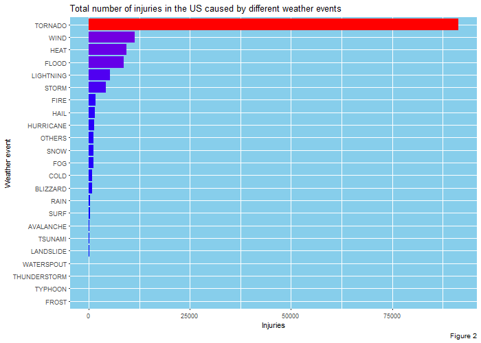

------------------------------------------------------------------------

#**Consequences of severe weather events in the U.S. between 1950 and 2011**

------------------------------------------------------------------------

###**Synopsis**
___________
In this report we try to figure out the consequences of harmful storm events in the United States between the years 1950 and 2011. 
Based on the results of this research we concluded that most harmful weather events for both public health and economy are Tornado, Flood and Hurricane.


###**DATA PROCESSING**  
__________________
We obtained our [data](https://d396qusza40orc.cloudfront.net/repdata%2Fdata%2FStormData.csv.bz2) from the U.S. National Oceanic and Atmospheric Administration's (NOAA) storm database. This database tracks characteristics of major storms and weather events in the United States which occurred in the period between 1950 and November of 2011. Information in database also including when and where they occur, as well as estimates of any fatalities, injuries, and property damage.

####1. Read and explore data
We first download the data from web resource and unzip it. Our data is comma-separated-value (CSV) file compressed via the bzip2 (size: 47 Mb).

```r
zip.file.url <- "https://d396qusza40orc.cloudfront.net/repdata%2Fdata%2FStormData.csv.bz2"
data.dir <- "./data"
     
if (!file.exists(data.dir)) {
     dir.create(data.dir)
}

zip.file <- paste0(data.dir, "/", "StormData.csv.bz2")
if (!file.exists(zip.file)) {
     download.file(zip.file.url, zip.file)
}

csv.file <- paste0(data.dir, "/", "StormData.csv")
if (!file.exists(csv.file)) {
     unzip(zip.file, exdir = data.dir)
}

library(readr)
noaa.data <- read_csv(csv.file)
```

```
## Parsed with column specification:
## cols(
##   .default = col_character(),
##   STATE__ = col_double(),
##   COUNTY = col_double(),
##   BGN_RANGE = col_double(),
##   COUNTY_END = col_double(),
##   END_RANGE = col_double(),
##   LENGTH = col_double(),
##   WIDTH = col_double(),
##   F = col_integer(),
##   MAG = col_double(),
##   FATALITIES = col_double(),
##   INJURIES = col_double(),
##   PROPDMG = col_double(),
##   CROPDMG = col_double(),
##   LATITUDE = col_double(),
##   LONGITUDE = col_double(),
##   LATITUDE_E = col_double(),
##   LONGITUDE_ = col_double(),
##   REFNUM = col_double()
## )
```

```
## See spec(...) for full column specifications.
```

After reading we look at the structure of our data:

```r
library(dplyr)
```

```
## 
## Attaching package: 'dplyr'
```

```
## The following objects are masked from 'package:stats':
## 
##     filter, lag
```

```
## The following objects are masked from 'package:base':
## 
##     intersect, setdiff, setequal, union
```

```r
glimpse(noaa.data)
```

```
## Observations: 902,297
## Variables: 37
## $ STATE__    <dbl> 1, 1, 1, 1, 1, 1, 1, 1, 1, 1, 1, 1, 1, 1, 1, 1, 1, ...
## $ BGN_DATE   <chr> "4/18/1950 0:00:00", "4/18/1950 0:00:00", "2/20/195...
## $ BGN_TIME   <chr> "0130", "0145", "1600", "0900", "1500", "2000", "01...
## $ TIME_ZONE  <chr> "CST", "CST", "CST", "CST", "CST", "CST", "CST", "C...
## $ COUNTY     <dbl> 97, 3, 57, 89, 43, 77, 9, 123, 125, 57, 43, 9, 73, ...
## $ COUNTYNAME <chr> "MOBILE", "BALDWIN", "FAYETTE", "MADISON", "CULLMAN...
## $ STATE      <chr> "AL", "AL", "AL", "AL", "AL", "AL", "AL", "AL", "AL...
## $ EVTYPE     <chr> "TORNADO", "TORNADO", "TORNADO", "TORNADO", "TORNAD...
## $ BGN_RANGE  <dbl> 0, 0, 0, 0, 0, 0, 0, 0, 0, 0, 0, 0, 0, 0, 0, 0, 0, ...
## $ BGN_AZI    <chr> NA, NA, NA, NA, NA, NA, NA, NA, NA, NA, NA, NA, NA,...
## $ BGN_LOCATI <chr> NA, NA, NA, NA, NA, NA, NA, NA, NA, NA, NA, NA, NA,...
## $ END_DATE   <chr> NA, NA, NA, NA, NA, NA, NA, NA, NA, NA, NA, NA, NA,...
## $ END_TIME   <chr> NA, NA, NA, NA, NA, NA, NA, NA, NA, NA, NA, NA, NA,...
## $ COUNTY_END <dbl> 0, 0, 0, 0, 0, 0, 0, 0, 0, 0, 0, 0, 0, 0, 0, 0, 0, ...
## $ COUNTYENDN <chr> NA, NA, NA, NA, NA, NA, NA, NA, NA, NA, NA, NA, NA,...
## $ END_RANGE  <dbl> 0, 0, 0, 0, 0, 0, 0, 0, 0, 0, 0, 0, 0, 0, 0, 0, 0, ...
## $ END_AZI    <chr> NA, NA, NA, NA, NA, NA, NA, NA, NA, NA, NA, NA, NA,...
## $ END_LOCATI <chr> NA, NA, NA, NA, NA, NA, NA, NA, NA, NA, NA, NA, NA,...
## $ LENGTH     <dbl> 14.0, 2.0, 0.1, 0.0, 0.0, 1.5, 1.5, 0.0, 3.3, 2.3, ...
## $ WIDTH      <dbl> 100, 150, 123, 100, 150, 177, 33, 33, 100, 100, 400...
## $ F          <int> 3, 2, 2, 2, 2, 2, 2, 1, 3, 3, 1, 1, 3, 3, 3, 4, 1, ...
## $ MAG        <dbl> 0, 0, 0, 0, 0, 0, 0, 0, 0, 0, 0, 0, 0, 0, 0, 0, 0, ...
## $ FATALITIES <dbl> 0, 0, 0, 0, 0, 0, 0, 0, 1, 0, 0, 0, 1, 0, 0, 4, 0, ...
## $ INJURIES   <dbl> 15, 0, 2, 2, 2, 6, 1, 0, 14, 0, 3, 3, 26, 12, 6, 50...
## $ PROPDMG    <dbl> 25.0, 2.5, 25.0, 2.5, 2.5, 2.5, 2.5, 2.5, 25.0, 25....
## $ PROPDMGEXP <chr> "K", "K", "K", "K", "K", "K", "K", "K", "K", "K", "...
## $ CROPDMG    <dbl> 0, 0, 0, 0, 0, 0, 0, 0, 0, 0, 0, 0, 0, 0, 0, 0, 0, ...
## $ CROPDMGEXP <chr> NA, NA, NA, NA, NA, NA, NA, NA, NA, NA, NA, NA, NA,...
## $ WFO        <chr> NA, NA, NA, NA, NA, NA, NA, NA, NA, NA, NA, NA, NA,...
## $ STATEOFFIC <chr> NA, NA, NA, NA, NA, NA, NA, NA, NA, NA, NA, NA, NA,...
## $ ZONENAMES  <chr> NA, NA, NA, NA, NA, NA, NA, NA, NA, NA, NA, NA, NA,...
## $ LATITUDE   <dbl> 3040, 3042, 3340, 3458, 3412, 3450, 3405, 3255, 333...
## $ LONGITUDE  <dbl> 8812, 8755, 8742, 8626, 8642, 8748, 8631, 8558, 874...
## $ LATITUDE_E <dbl> 3051, 0, 0, 0, 0, 0, 0, 0, 3336, 3337, 3402, 3404, ...
## $ LONGITUDE_ <dbl> 8806, 0, 0, 0, 0, 0, 0, 0, 8738, 8737, 8644, 8640, ...
## $ REMARKS    <chr> NA, NA, NA, NA, NA, NA, NA, NA, NA, NA, NA, NA, NA,...
## $ REFNUM     <dbl> 1, 2, 3, 4, 5, 6, 7, 8, 9, 10, 11, 12, 13, 14, 15, ...
```

For our analysis we are interested only in these variables from the dataset:

* **BGN_DATE** The date when weather event was occured

* **FATALITIES** The number of fatalities in the population caused by weather event

* **INJURIES** The number of injured people

* **PROPDMG** The estimated value of property damage (in U.S dollars) 

* **PROPDMGEXP** The amount multiplier for `PROPDMG` variable (“K” for thousands, “M” for millions, and “B” for billions and etc) 

* **CROPDMG** The estimated value of crop damage (in U.S dollars) 

* **CROPDMGEXP** The amount multiplier for `CROPDMG` variable (“K” for thousands, “M” for millions, and “B” for billions and etc)

More information about the dataset you can find here:

* National Weather Service Storm Data [Documentation](https://d396qusza40orc.cloudfront.net/repdata%2Fpeer2_doc%2Fpd01016005curr.pdf). 

* National Climatic Data Center Storm Events [FAQ](https://d396qusza40orc.cloudfront.net/repdata%2Fpeer2_doc%2FNCDC%20Storm%20Events-FAQ%20Page.pdf)

Look at possible damage multiplier values i.e *DMGEXP variables:

```r
table(noaa.data$PROPDMGEXP)
```

```
## 
##      -      ?      +      0      1      2      3      4      5      6 
##      1      8      5    216     25     13      4      4     28      4 
##      7      8      B      h      H      K      m      M 
##      5      1     40      1      6 424665      7  11330
```

```r
table(noaa.data$CROPDMGEXP)
```

```
## 
##      ?      0      2      B      k      K      m      M 
##      7     19      1      9     21 281832      1   1994
```
There are several problems here, we see values in different cases, and some meaningless values like `-, ?, +`.

Explore types of weather events in `EVTYPE`:

```r
Event.types <- sort(unique(noaa.data$EVTYPE))
length(Event.types)
```

```
## [1] 977
```

```r
Event.types[c(1, 45:48, 237:239, 351:354)]
```

```
##  [1] "?"                "Coastal Flood"    "COASTAL FLOOD"   
##  [4] "coastal flooding" "Coastal Flooding" "HAIL 0.75"       
##  [7] "HAIL 0.88"        "HAIL 075"         "HIGH WIND"       
## [10] "HIGH WIND (G40)"  "HIGH WIND 48"     "HIGH WIND 63"
```
Here we display only small slice of values cause full list is too big, but it is 100% true that variable needs to be almost fully cleaned.

####2. Clean and tidy data

Subset, exclude zero values and set descriptive variable names:

```r
noaa.data.sub <- select(noaa.data, BGN_DATE, EVTYPE, FATALITIES, 
                        INJURIES, PROPDMG, CROPDMG, PROPDMGEXP, CROPDMGEXP) %>%
                   filter(FATALITIES > 0 | INJURIES > 0 | PROPDMG > 0 | CROPDMG > 0)

names(noaa.data.sub) <- c("Date", "Event.Type", "Fatalities", "Injuries", "Property.Damage", 
                          "Crop.Damage", "Property.Damage.Mult", "Crop.Damage.Mult")

# remove original dataset
rm(noaa.data)

noaa.data.sub
```

```
## # A tibble: 254,633 x 8
##                  Date Event.Type Fatalities Injuries Property.Damage
##                 <chr>      <chr>      <dbl>    <dbl>           <dbl>
##  1  4/18/1950 0:00:00    TORNADO          0       15            25.0
##  2  4/18/1950 0:00:00    TORNADO          0        0             2.5
##  3  2/20/1951 0:00:00    TORNADO          0        2            25.0
##  4   6/8/1951 0:00:00    TORNADO          0        2             2.5
##  5 11/15/1951 0:00:00    TORNADO          0        2             2.5
##  6 11/15/1951 0:00:00    TORNADO          0        6             2.5
##  7 11/16/1951 0:00:00    TORNADO          0        1             2.5
##  8  1/22/1952 0:00:00    TORNADO          0        0             2.5
##  9  2/13/1952 0:00:00    TORNADO          1       14            25.0
## 10  2/13/1952 0:00:00    TORNADO          0        0            25.0
## # ... with 254,623 more rows, and 3 more variables: Crop.Damage <dbl>,
## #   Property.Damage.Mult <chr>, Crop.Damage.Mult <chr>
```

Coerce `Date` as Date, and use upper cases on `Event.Type, Property.Damage.Mult, Crop.Damage.Mult`:

```r
library(lubridate)
```

```
## 
## Attaching package: 'lubridate'
```

```
## The following object is masked from 'package:base':
## 
##     date
```

```r
library(tidyr)

noaa.data.sub <- separate(noaa.data.sub, Date, into = c("Date", "Time"), sep = "\\s+") %>% 
                   mutate(Date = mdy(Date), 
                          Event.Type = toupper(Event.Type),
                          Property.Damage.Mult = toupper(Property.Damage.Mult), 
                          Crop.Damage.Mult = toupper(Crop.Damage.Mult)) %>% 
                     select(-Time)
```

Calculate real amount of damage value using multipliers, and exclude multipliers from dataset:

```r
noaa.data.sub <- mutate(noaa.data.sub, 
                        Property.Damage = 
                          Property.Damage * 
                                        case_when(
                                          Property.Damage.Mult == "1"           ~ 1e+01,
                                          Property.Damage.Mult %in% c("2", "H") ~ 1e+02,         
                                          Property.Damage.Mult %in% c("3", "K") ~ 1e+03,
                                          Property.Damage.Mult == "4"           ~ 1e+04,
                                          Property.Damage.Mult == "5"           ~ 1e+05,
                                          Property.Damage.Mult %in% c("6", "M") ~ 1e+06,
                                          Property.Damage.Mult == "7"           ~ 1e+07,
                                          Property.Damage.Mult == "8"           ~ 1e+08,
                                          Property.Damage.Mult %in% c("B", "9") ~ 1e+09,
                                          TRUE ~ 1),
                        Crop.Damage = 
                          Crop.Damage * 
                                        case_when(
                                          Crop.Damage.Mult == "2" ~ 1e+02,         
                                          Crop.Damage.Mult == "K" ~ 1e+03,
                                          Crop.Damage.Mult == "M" ~ 1e+06,
                                          Crop.Damage.Mult == "9" ~ 1e+09,
                                          TRUE ~ 1)
                        ) %>% 
                   select(-c(Property.Damage.Mult, Crop.Damage.Mult))

head(noaa.data.sub)
```

```
## # A tibble: 6 x 6
##         Date Event.Type Fatalities Injuries Property.Damage Crop.Damage
##       <date>      <chr>      <dbl>    <dbl>           <dbl>       <dbl>
## 1 1950-04-18    TORNADO          0       15           25000           0
## 2 1950-04-18    TORNADO          0        0            2500           0
## 3 1951-02-20    TORNADO          0        2           25000           0
## 4 1951-06-08    TORNADO          0        2            2500           0
## 5 1951-11-15    TORNADO          0        2            2500           0
## 6 1951-11-15    TORNADO          0        6            2500           0
```

Clean event types using simple dictionary of common weather event types. But this transformation takes a lot of time, so we save our dataset with cleaned event types into rda file:

```r
rda.file <- paste0(data.dir, "/", "noaa_ds_clean.rda")

if(file.exists(rda.file)) {
     load(file = rda.file, verbose = TRUE)
} else {
          
     #define common types of events
     common.events <- c("TORNADO","STORM","HAIL","THUNDERSTORM","HURRICANE","LIGHTNING",
                        "RAIN","HEAT","FLOOD","WIND","FOG","WATERSPOUT","COLD","FREEZE",
                        "SLEET","SNOW","FIRE","MUDSLIDES","BLIZZARD","FROST","VOLCANIC",
                        "AVALANCHE","SURF","TSUNAMI","TYPHOON","LANDSLIDE")
     
     #replace some misspelling
     noaa.data.sub$Event.Type <- gsub("WINTER", "COLD", noaa.data.sub$Event.Type)
     noaa.data.sub$Event.Type <- gsub("FLD", "FLOOD", noaa.data.sub$Event.Type)
     noaa.data.sub$Event.Type <- gsub("THUNDERSTORM", "THNDRS", noaa.data.sub$Event.Type)
     
     #replace non word symbols like /,- etc
     noaa.data.sub$Event.Type <- gsub("\\W+", " ", noaa.data.sub$Event.Type)
     
     for(i in seq_along(common.events)) {
          noaa.data.sub$Event.Type <- 
               unlist(lapply(noaa.data.sub$Event.Type, 
                             function(x) if_else(grepl(common.events[i],x),common.events[i], x) 
                             ))
     }
     
     noaa.data.clean <- mutate(noaa.data.sub, 
                               Event.Type = case_when(Event.Type == "THNDRS" ~ "THUNDERSTORM",
                                                      !(Event.Type %in% common.events) ~ "OTHERS",
                                                      TRUE ~ Event.Type) 
                               )
     
     save(noaa.data.clean, file = rda.file)
}
```

```
## Loading objects:
##   noaa.data.clean
```

```r
rm(noaa.data.sub)

table(noaa.data.clean$Event.Type)
```

```
## 
##    AVALANCHE     BLIZZARD         COLD         FIRE        FLOOD 
##          268          255          808         1258        33166 
##          FOG       FREEZE        FROST         HAIL         HEAT 
##          189          147            8        26669          980 
##    HURRICANE    LANDSLIDE    LIGHTNING    MUDSLIDES       OTHERS 
##          224          196        13310            2         1415 
##         RAIN        SLEET         SNOW        STORM         SURF 
##         1246            6         1854         2991          224 
## THUNDERSTORM      TORNADO      TSUNAMI      TYPHOON     VOLCANIC 
##           19        39970           14            9            2 
##   WATERSPOUT         WIND 
##           55       129348
```

Convert our dataset from wide to long format:

```r
noaa.data.long <- gather(noaa.data.clean, key = Harm.Type, value = Harm.Value, -Date, -Event.Type) %>% 
                    filter(!is.na(Harm.Value) & Harm.Value > 0) %>% 
                      mutate(Harm.Type = gsub("\\.", " ", Harm.Type))
noaa.data.long
```

```
## # A tibble: 285,851 x 4
##          Date Event.Type  Harm.Type Harm.Value
##        <date>      <chr>      <chr>      <dbl>
##  1 1952-02-13    TORNADO Fatalities          1
##  2 1952-02-13    TORNADO Fatalities          1
##  3 1952-03-22    TORNADO Fatalities          4
##  4 1953-02-20    TORNADO Fatalities          1
##  5 1953-04-18    TORNADO Fatalities          6
##  6 1953-05-01    TORNADO Fatalities          7
##  7 1953-05-01    TORNADO Fatalities          2
##  8 1955-04-24    TORNADO Fatalities          5
##  9 1956-04-15    TORNADO Fatalities         25
## 10 1957-04-08    TORNADO Fatalities          2
## # ... with 285,841 more rows
```

```r
rm(noaa.data.clean)
```

Check for NA values:

```r
sum(is.na(noaa.data.long))
```

```
## [1] 0
```

####3. Calculate totals 
Calculate totals for each type of weather event and harm:

```r
noaa.data.total <- select(noaa.data.long, -Date) %>% 
                         group_by(Harm.Type, Event.Type) %>% 
                              summarise(Harm.Value = sum(Harm.Value))

noaa.data.total
```

```
## # A tibble: 95 x 3
## # Groups:   Harm.Type [?]
##      Harm.Type Event.Type Harm.Value
##          <chr>      <chr>      <dbl>
##  1 Crop Damage   BLIZZARD  112060000
##  2 Crop Damage       COLD 1424115500
##  3 Crop Damage       FIRE  403281630
##  4 Crop Damage      FLOOD 7275444205
##  5 Crop Damage     FREEZE 1689061000
##  6 Crop Damage      FROST  108000000
##  7 Crop Damage       HAIL 3111712873
##  8 Crop Damage       HEAT  504469280
##  9 Crop Damage  HURRICANE 4005292802
## 10 Crop Damage  LANDSLIDE   20017000
## # ... with 85 more rows
```


###**Results**
__________

The goal of our analysis is answer to the questions below:

* Across the United States, which types of events are most harmful with respect to population health?

* Across the United States, which types of events have the greatest economic consequences?


> Across the United States, which types of events are most harmful with respect to population health?


```r
library(ggplot2)

#define figures folder
fig.dir <- "./figures"

if (!file.exists(fig.dir)) {
     dir.create(fig.dir)
}

#define png file name
png.file <- paste0(fig.dir, "/", "fig1.png")
png(filename = png.file, width = 700, height = 500, units = "px")

ggplot(
     data = filter(noaa.data.total, Harm.Type == "Fatalities"),
     aes(
          x = reorder(Event.Type, Harm.Value),
          y = Harm.Value,
          fill = Harm.Value
     )
) +
     geom_bar(stat = "identity") +
     scale_fill_gradient(low = "blue", high = "red") +
     coord_flip() +
     theme(legend.position = "none",
           panel.background = element_rect(fill = "skyblue")) +
     labs(title = "Total number of fatalities in the US caused by different weather events",
          y = "Fatalities",
          x = "Weather event",
          caption = "Figure 1")

dev.off()
```

```
## png 
##   2
```


```r
#define png file name
png.file <- paste0(fig.dir, "/", "fig2.png")
png(filename = png.file, width = 700, height = 500, units = "px")

ggplot(
     data = filter(noaa.data.total, Harm.Type == "Injuries"),
     aes(
          x = reorder(Event.Type, Harm.Value),
          y = Harm.Value,
          fill = Harm.Value
     )
) +
     geom_bar(stat = "identity") +
     scale_fill_gradient(low = "blue", high = "red") +
     coord_flip() +
     theme(legend.position = "none",
           panel.background = element_rect(fill = "skyblue")) +
     labs(title = "Total number of injuries in the US caused by different weather events",
          y = "Injuries",
          x = "Weather event", 
          caption = "Figure 2")
dev.off()
```

```
## png 
##   2
```



> Across the United States, which types of events have the greatest economic consequences?


```r
#define png file name
png.file <- paste0(fig.dir, "/", "fig3.png")
png(filename = png.file, width = 700, height = 500, units = "px")

ggplot(
     data = filter(noaa.data.total, Harm.Type == "Property Damage") %>% mutate(Harm.Value = Harm.Value/10^9),
     aes(
          x = reorder(Event.Type, Harm.Value),
          y = Harm.Value,
          fill = Harm.Value
     )
) +
     geom_bar(stat = "identity") +
     scale_fill_gradient(low = "blue", high = "red") +
     coord_flip() +
     theme(legend.position = "none",
           panel.background = element_rect(fill = "skyblue")) +
     labs(title = "Amount of estimated property damage in the US caused by different weather events",
          y = "Property Damage (in billion dollars)",
          x = "Weather event",
          caption = "Figure 3")

dev.off()
```

```
## png 
##   2
```


```r
#define png file name
png.file <- paste0(fig.dir, "/", "fig4.png")
png(filename = png.file, width = 700, height = 500, units = "px")

ggplot(
     data = filter(noaa.data.total, Harm.Type == "Crop Damage") %>% mutate(Harm.Value = Harm.Value/10^9),
     aes(
          x = reorder(Event.Type, Harm.Value),
          y = Harm.Value,
          fill = Harm.Value
     )
) +
     geom_bar(stat = "identity") +
     scale_fill_gradient(low = "blue", high = "red") +
     coord_flip() +
     theme(legend.position = "none",
           panel.background = element_rect(fill = "skyblue")) +
     labs(title = "Amount of estimated crop damage in the US caused by different weather events",
          y = "Crop Damage (in billion dollars)",
          x = "Weather event",
          caption = "Figure 4")
dev.off()
```

```
## png 
##   2
```


###**Conclusion**
_________________

After finishing a data visualization process we concluded that,

* **The most deadly weather events (in ascending order)**
     + *TORNADO*
     + *HEAT*
     + *FLOOD*

* **The most harmful weather events by number of injuried people**
     + *TORNADO*
     + *WIND*
     + *HEAT*
  
* **The most harmful to the economy weather events, by amount of estimated property damage** 
     + *FLOOD*
     + *HURRICANE*
     + *STORM*
     + *TORNADO*
  
* **The most harmful to the economy weather events, by amount of estimated crop damage** 
     + *OTHERS*
     + *FLOOD*
     + *HURRICANE*
     + *HAIL*
